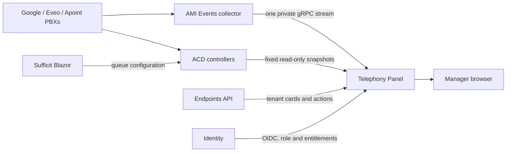

# Sufficit telephony system overview

**Canonical status:** 2026-09-14. This document records the current implementation
and the decisions made during the internal pilot. Dated activity reports preserve
historical evidence but do not override this guide.

## Product and ownership

Sufficit Telephony Panel is the internal, manager-only operational observability
application at <https://panel.sufficit.com.br/>. Its public URL has no application
path suffix. It is built with .NET 10, Blazor and Sufficit.Blazor.UI (SUI), with
English source code and English/Portuguese UI resources. Language and theme
preferences are stored locally in the browser; English is the default.

Responsibility is deliberately split:

| Component | Owns |
| --- | --- |
| Telephony Panel | Live PBX observation, dedicated board, queue/runtime state, registration diagnostics and supervised listening |
| Sufficit Blazor | Queue, member, destination and SIP configuration |
| Telephony ACD | Shared queue definitions and runtime admission/distribution |
| AMI Events | Bounded multi-PBX event collection and server-side telemetry stream |
| Endpoints API | Authorized tenant cards, preferred supervisor endpoint and supervision actions |
| Identity | Sign-in, exact `manager` role and entitlements |

The main `sufficit-blazor` application must not regain live AMI widgets, monitoring
subscriptions or registration history. Its old telephony monitor routes redirect to
the Panel and forward only bounded presentation parameters. Billing and business
call records remain separate from operational monitoring.

## Access and security

- Only a current Identity role named exactly `manager` opens protected views.
- OIDC authorization code with PKCE and a server-side cookie is used. Tokens are
  never stored in JavaScript or localStorage.
- Authorization is revalidated server-side. Anonymous protected API calls return
  401; UI denial remains fail-closed.
- Token/session and permission caches are bounded. Access-token expiry requires a
  new sign-in; a cached allow decision is not extended during an Identity failure.
- The Panel Identity client receives a signed JWT access token compatible with the
  existing APIs. Its exact-client rule was applied without changing other clients.
- Manager fleet visibility does not make visual filters into permissions. Each
  supervision request is authorized again against a fresh concrete target.
- Upstream keys live in protected server files and never in Git, browser responses,
  URLs or logs. Previously supplied temporary tokens must be considered ephemeral
  operator input, not documentation or application configuration.
- Customer publication and customer notifications are intentionally deferred.

Authenticated manager use and the real Listen audio path have been exercised.
Independent non-manager denial, live role revocation and real Whisper audio still
need explicit acceptance evidence before customer publication.

## Routes and interaction model

| Route | Purpose |
| --- | --- |
| `/` | Full operational workspace with extensions, calls, channels, trunks, queues, events and settings |
| `/board` | Dedicated television/operator mosaic; only the board, compact controls and overlays |
| `/queues` | Unified queue/runtime and endpoint-registration diagnostics |
| `/?area=infrastructure` | PBX metrics and bounded infrastructure history |
| `/mesa` | Permanent compatibility redirect to `/board` |
| `/login`, `/logout` | Authentication entry/exit |
| `/health` | Service health |
| `/api/fleet` | Manager-protected fleet snapshot |

All stable filters update the URL so a view can be refreshed or shared. The
canonical company/context key is `contextid`, never `company`. Context, node,
queue and text filters are optional for managers. Text search affects all resource
types by default and can be scoped independently to extensions, queues or trunks.
Node means observed source/provenance; it never assigns an application to a PBX.

The `/board` route is a true dedicated screen: no product header, navigation,
help panels or page footer. Filters live in a compact popover near the resource
count, persist after it closes and remain URL-backed. Resource details and
supervision confirmation open as bounded overlays, including in browser fullscreen;
normal settings links open in another tab. Free screen height is used before a
section scrolls.

Board presentation rules are shared, manager-only configuration with draft preview
and optimistic concurrency. They can classify extension/trunk patterns, group trunk
aliases and hide resources. The initial import follows the existing Flash Operator
Panel conventions. These rules change presentation only; they never alter Asterisk
or grant supervision permission. An active-channel filter replaces decorative
"most observed" summaries. Motion is purposeful and respects reduced-motion;
audible browser alerts are local and opt-in.

## Observation model

The three PBXs are sources of evidence, not separate products. The default manager
view combines Apoint, Eveo and Google. A source filter is available for diagnostics.

Stable resources are unified by resource identity inside a context. The same name
in different contexts is never merged. The UI does not create one copy of every
queue or extension per server. Source provenance remains available in details.

### Calls and channels

A channel is one technical Asterisk call leg; it is not necessarily a distinct
call. On each PBX, current legs sharing `Linkedid` are grouped into one displayed
call. Legs without `Linkedid` remain explicitly uncorrelated. No global cross-PBX
deduplication is claimed. This prevents Local, SIP/PJSIP, queue offer and bridge
legs from inflating the call count while preserving the exact channel needed for
diagnostics and supervision.

Call flow correlation uses fresh node, context, unique ID, linked ID and channel
evidence. Ambiguous evidence is shown as ambiguous rather than assigned to an
extension, trunk, queue or caller. A channel in `Up` state means answered at the
Asterisk level; it does not prove that an attendant is speaking because greetings
and applications may already have answered it.

### Remembered resources

The default-on **remember previously seen resources** option keeps known extension,
trunk and queue identities visible while idle or disconnected. It retains existence
and labels, not old calls, parties or availability. Managers share the inventory;
an explicit clear operation is required to forget it. The private state is bounded
to 100,000 resources/128 MiB. Channels themselves are not retained as resources.
Current projections and board patterns have smaller defensive limits.

### Evidence and counters

Fresh readings drive live state. A partial multi-source result uses a lower-bound
counter (`at least`) rather than pretending to be complete. If all relevant sources
are stale/unavailable, counts are unknown instead of zero. Replica capacity is not
summed. Conflicting fresh registration evidence is labelled **Different readings**.

## Extensions and registration diagnostics

Endpoint state distinguishes registration, reachability, usage and observation
freshness. The operator can diagnose registered, available, busy, paused and
disconnected states without treating an unknown state as available.

Registration history is a bounded journal of observed changes, not an exact SIP
REGISTER audit log. It retains up to 20 changes over seven days per identity/source
and may include current contact address, Via address, declared User-Agent and
expiry. User-Agent is self-declared and does not verify the hardware model. No SIP
credentials, raw private SIP URIs, recordings or call audio are stored.

Eveo and Apoint currently expose four lab identities each. Google uses a separate
read-only facade scoped to the Sufficit context and extensions 6001/6007. Extension
6007 has been observed registered through `chan_sip`; actual contact addresses are
operational data and are intentionally absent from this repository. For legacy SIP,
the internal `Expire` scheduler number is not a renewal timestamp and is ignored.
PJSIP expiration changes may provide renewal evidence. Earlier identical renewals
cannot be reconstructed.

The `/queues` page presents one registration list across authorized sources, not
one section per server. Individual history entries disclose their source.

## Queue configuration and behavior

The product label is **Filas de atendimento**. ACD means **Automatic Call
Distribution** (distribuição automática de chamadas): the rules that admit calls
and distribute them to attendants. User-facing help must explain this instead of
assuming the acronym is understood.

A queue is registered once by `contextid` and queue identity and applies equally to
the PBXs that host that context. It is not assigned to a server. Runtime observation
still reports the PBX through which a particular call arrived. Google is the current
production focus; Eveo and Apoint are test environments while runtime parity is
completed.

Configuration in Sufficit Blazor uses:

- list: `/pages/telephony/acd?contextid=...`;
- separate editor: `/pages/telephony/acd/edit?contextid=...&queueid=...`;
- a floating save action only when the form is dirty;
- revision/ETag optimistic concurrency instead of silent overwrites;
- a shared telephony destination selector, contextual by default. Managers may
  temporarily search another context; the saved value is the literal destination.

The editor supports title, enabled state, maximum waiting calls, maximum wait,
distribution strategy, agent ring time, retry interval, wrap-up, queue weight,
parallel/ring-all capability, announcements, exit digit and explicit failure
destinations. Strategies include sequential, round-robin, random and capability-
advertised ring-all. Failure routing distinguishes at least queue full, no available
attendant, timeout and caller keypad exit.

Disabling a queue prevents new admissions after synchronization; already admitted
calls are allowed to finish. Configuration changes are shared and do not require
selecting a node. Runtime controllers must expose synchronization/revision health so
a saved-but-not-applied configuration is visible rather than silently appearing
active.

The Sufficit pilot copied queue 0000006500's fallback destination
`app-announcement-962,s,1`. Alias 6599 exists in the Sufficit Google context for an
isolated inbound-like test without changing customer DIDs or unrelated extensions.

Queue attendants can join/leave, pause/resume with a reason, auto-pause after
configured failures and be distributed by the chosen strategy. The target state
model distinguishes registered, available, busy, paused and disconnected so the
controller does not offer a call to an ineligible endpoint.

## Queue runtime projection

The board combines native Asterisk Queue activity from AMI with ARI ACD controller
snapshots. It never synthesizes AMI events. Each ACD identity contains context and
queue UUID and is not matched merely by title, dial alias or caller number.

Visible call stages are:

1. greeting;
2. waiting;
3. announcement;
4. offering/calling an attendant;
5. connected/in service.

An ACD visit is attached to a live channel only when node, context, unique ID and,
when supplied, channel name agree uniquely. Its `Linkedid` then exposes related
legs. Missing/ambiguous evidence remains uncorrelated. Counts represent visits,
not the number of offer legs.

During the pilot, extension 6007 called alias 6599 successfully; the waiting call
and correct destination appeared after call-leg correlation fixes. A greeting can
be visible on the extension before the queue controller has admitted the visit;
this is expected under the current admission boundary, but the UI now has an
explicit greeting stage when controller evidence is present.

Controller snapshots refresh every five seconds. Current agent evidence expires
after 15 seconds. Old or failed snapshots retain known queue identity but hide stale
callers, stages and counts. A failing source does not suppress healthy sources.

## Supervision: Listen and Whisper

Extension, queue and trunk cards expose a context menu for channel supervision:

- **Listen** lets the supervisor hear a selected live channel without transmitting
  microphone audio to it.
- **Whisper** lets the supervisor speak only to the selected attendant/channel leg.
- **Continuous by prefix** can follow future authorized channels matching a concrete
  routing prefix. Display filters are never accepted as authorization prefixes.

If a card resolves to one eligible live subchannel, the action proceeds directly to
the supervision confirmation/call flow without a redundant channel chooser. With
multiple eligible legs, the operator chooses the exact target. Queue names are not
implicitly channel prefixes; only server-authorized concrete routing prefixes work.

The browser receives no AMI credentials and no relayed call audio. The server uses
the operator's preferred registered endpoint and the established Endpoints API
Originate/monitor path. Before every action it revalidates current manager access,
context/account scope, node, channel freshness and allowed prefix. Operations are
serialized for 15 seconds and are not automatically retried, preventing duplicate
origination. The real Listen audio path was manually accepted during the pilot.

## Data transport and scale protections

Panel consumes one shared, server-side gRPC telemetry stream over
`/run/sufficit-ami-observation/telemetry.sock`. Browser tabs do not create AMI or
collector connections. Removing `Telemetry:Socket` explicitly selects the legacy
SignalR path; a broken configured socket does not silently fall back.

ACD and registration sources are fixed private HTTP endpoints with server-only,
read-only credentials. URLs cannot be overridden from query strings. Requests have
strict host, redirect, time, response-size, concurrency, source and context bounds,
plus a short shared cache. Infrastructure metrics are queried separately. The
system does not archive an unbounded raw AMI stream.

These choices allow many browser sessions to share collection work while keeping
per-session projections bounded. They are not yet proof of full production load or
high-availability behavior.

## Deployment and current versions

Panel is deployed only on Eveo Apps for the internal pilot. Nginx terminates TLS and
proxies to a Kestrel Unix socket. A dedicated `sufftelpanel` account, systemd
hardening and a 512 MiB memory ceiling isolate the service. Releases are immutable;
`current` changes only after build/health checks, and rollback points to the previous
release. Persistent known-resource and board-rule files remain outside releases.

Normal Panel deployment restarts only the Panel. It does not restart Asterisk,
Identity, Blazor or PBX applications. Panel changes must not edit the checkout Nginx
configuration. DNS/root routing is already established.

| Component | Current observed state on 2026-09-14 |
| --- | --- |
| Panel source | 0.13.1; repository revision `4578a2f` before this documentation change |
| Panel live | release `unified-monitoring-20260913`, healthy, no recorded systemd restarts |
| Eveo/Apoint ACD lab | controller 0.10.4, Asterisk active |
| Google ACD | isolated controller 0.9.0 plus registration observer/facade; Asterisk active |
| ACD repository | source 0.10.5; newer source is not evidence of Google deployment |
| Sufficit Blazor | 1.26.0913.2233 at revision `bd729ff` during verification |
| AMI Events | revision `91b115a` during verification |

Versions are evidence from that date, not a permanent compatibility promise. The
Google controller is intentionally not replaced just because newer lab source
exists; production changes require their own drain, migration and rollback plan.

## Validation completed

- Panel: 787 deterministic checks and browser fixture suite after unified-source
  monitoring; Release builds and diff validation passed.
- ACD: collector/proxy focused tests and both .NET 10 and deployed .NET 7 integration
  suites passed at their recorded checkpoints.
- Blazor: focused queue/UI checks and the deployment workflow passed all targets at
  the recorded checkpoint.
- Public Panel health is 200; anonymous `/api/fleet` is 401.
- Real pilot: a 6007-to-6599 queue call appeared with corrected destination and
  queue stage; real supervised Listen audio was confirmed by the operator.

Synthetic/browser fixtures are clearly marked and never bypass Production auth.
Checks do not replace real call acceptance.

## Known gaps and ordered next work

The project is internal and not yet announced. The remaining priority is runtime
reliability, not customer publication:

1. Validate actual attendant availability across registered, available, busy,
   paused and disconnected states.
2. Exercise distribution with real extensions: answer, bidirectional audio, no
   answer, hangup, concurrent queues and prevention of double offering.
3. Validate every visible stage and configurable audio: greeting, music, periodic
   announcements, position and estimated wait.
4. Validate separate failure destinations for full, no attendants, timeout and
   keypad exit, including the disabled-queue synchronization boundary.
5. Validate join/leave, pause reasons, auto-pause, wrap-up and all supported
   distribution strategies.
6. Exercise Whisper audio, non-manager denial and live role revocation.
7. Run sustained load/failure/HA tests and expand registration inventory beyond the
   current bounded pilot identities.
8. Only after those gates, design entitlements and publication for customers.

## Historical timeline

- **2026-09-10:** repository/product rename, SUI host, Identity client/token format,
  root DNS, manager central monitor, call/channel grouping, operator board,
  configuration rules and remembered resources.
- **2026-09-11:** dedicated mosaic-only board, overlay details, URL-backed
  `contextid` filters, adaptive board space and corrected queue call flow.
- **2026-09-12:** card supervision, ACD board/source deployment, direct single-channel
  supervision and idle endpoint-prefix resolution.
- **2026-09-13:** monitoring removed from Sufficit Blazor, Google registration
  diagnostics, and unified queue/registration presentation across sources.
- **2026-09-14:** this canonical consolidation documents the current boundary,
  evidence, limitations and acceptance sequence.

See the [documentation index](README.md) for detailed contracts and dated evidence.
